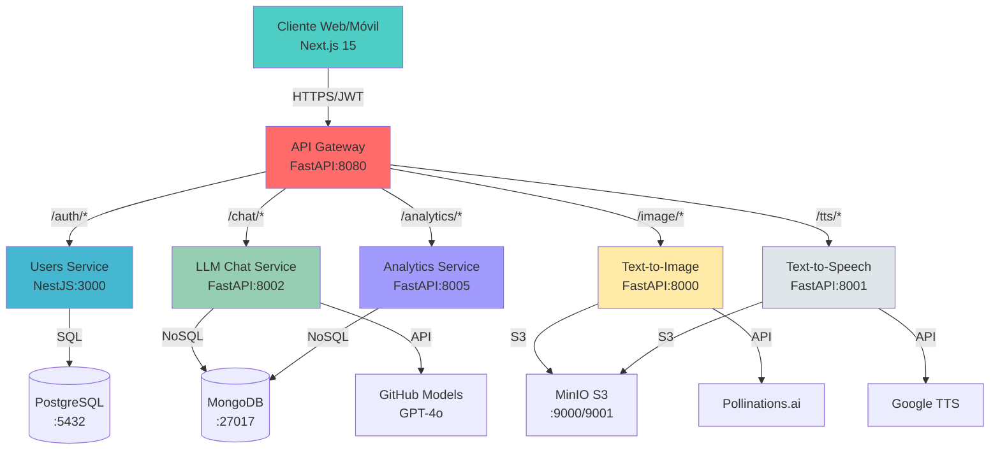

# 🚀 LLM Microservices Platform

[](https://opensource.org/licenses/MIT)
[](https://www.docker.com/)
[](https://nextjs.org/)
[](https://nestjs.com/)
[](https://fastapi.tiangolo.com/)

Plataforma empresarial de microservicios para APIs LLM con autenticación JWT, almacenamiento S3, analíticas en tiempo real y frontend moderno. Arquitectura escalable diseñada para procesamiento de IA, generación de contenido multimedia y análisis de datos.

## 📋 Tabla de Contenidos

- [Características Principales](#-características-principales)
- [Arquitectura del Sistema](#️-arquitectura-del-sistema)
- [Servicios Implementados](#-servicios-implementados)
- [Stack Tecnológico](#-stack-tecnológico)
- [Inicio Rápido](#-inicio-rápido)
- [Configuración del Entorno](#-configuración-del-entorno)
- [Desarrollo Local](#️-desarrollo-local)
- [APIs y Endpoints](#-apis-y-endpoints)
- [Autenticación y Seguridad](#-autenticación-y-seguridad)
- [Almacenamiento y Bases de Datos](#️-almacenamiento-y-bases-de-datos)
- [Frontend Dashboard](#-frontend-dashboard)
- [Deployment](#-deployment)
- [Testing](#-testing)
- [Monitoreo y Logs](#-monitoreo-y-logs)
- [Troubleshooting](#-troubleshooting)
- [Roadmap](#-roadmap)
- [Contribución](#-contribución)
- [Licencia](#-licencia)

## ✨ Características Principales

- 🔐 **Autenticación JWT robusta** con access y refresh tokens
- 🎨 **Generación de imágenes con IA** usando Pollinations.ai
- 🔊 **Text-to-Speech multiidioma** con soporte para 20+ idiomas
- 💬 **Chat LLM** integrado con GitHub Models (GPT-4o)
- 📊 **Analytics en tiempo real** con MongoDB
- 🌐 **API Gateway unificado** para enrutamiento centralizado
- 🖥️ **Dashboard moderno** con Next.js 15 y React 19
- 🗄️ **Almacenamiento S3** compatible con MinIO
- 🐳 **Containerización completa** con Docker Compose
- 📈 **Escalabilidad horizontal** por microservicio
- 🔒 **Seguridad por capas** con validación y sanitización
- 📝 **Historial completo** de todas las operaciones

## 🏗️ Arquitectura del Sistema



## 🎯 Servicios Implementados

### ✅ Frontend Dashboard (Next.js 15)

- **Puerto:** 3001 (desarrollo)
- **Framework:** Next.js 15 + React 19
- **UI:** Tailwind CSS + shadcn/ui + Radix UI
- **Características:**
  - 🎨 Dashboard moderno con tema claro/oscuro
  - 🔐 Sistema completo de autenticación (login/registro)
  - 🖼️ Interfaz de generación de imágenes con preview
  - 🔊 Generador de audio text-to-speech
  - 💬 Chat interactivo con LLM
  - 📊 Visualización de historial y estadísticas
  - 📱 Diseño responsive y optimizado
  - ⚡ Turbopack para desarrollo ultra-rápido
  - 🎭 Animaciones con Framer Motion
  - 📋 Formularios con React Hook Form + Zod

### ✅ API Gateway (FastAPI)

- **Puerto:** 8080
- **Framework:** FastAPI + Python 3.11
- **Características:**
  - 🔀 Enrutamiento centralizado a todos los servicios
  - 🔐 Validación JWT en el gateway
  - 📊 Métricas y logging centralizado
  - 🚦 Rate limiting y throttling
  - 🔄 Proxy reverso con balanceo de carga
  - 📝 Documentación OpenAPI unificada

### ✅ Users/Auth Service (NestJS)

- **Puerto:** 3000
- **Framework:** NestJS + TypeScript
- **Base de datos:** PostgreSQL 16
- **Características:**
  - 👤 Registro y autenticación de usuarios
  - 🔑 JWT con access tokens (15min) y refresh tokens (30d)
  - 🔄 Gestión de sesiones persistentes
  - 🔒 Hash de contraseñas con bcrypt
  - 📧 Validación de email único
  - 🛡️ Guards y decoradores personalizados
  - 📝 Logs estructurados

### ✅ LLM Chat Service (FastAPI)

- **Puerto:** 8002
- **Framework:** FastAPI + Python 3.11
- **Base de datos:** MongoDB 7
- **Proveedor:** GitHub Models (GPT-4o, GPT-4o-mini)
- **Características:**
  - 💬 Chat conversacional con contexto
  - 🧠 Múltiples modelos LLM disponibles
  - 📝 Historial de conversaciones
  - 👤 Chats por usuario autenticado
  - 🌊 Streaming de respuestas (opcional)
  - 📊 Analytics de uso por modelo
  - 🔧 Configuración de parámetros (temperatura, max_tokens)

### ✅ Text-to-Image Service (FastAPI)

- **Puerto:** 8000
- **Framework:** FastAPI + Python 3.11
- **Almacenamiento:** MinIO (S3-compatible)
- **Proveedor:** Pollinations.ai
- **Características:**
  - 🎨 Generación de imágenes desde prompts
  - 📐 Múltiples tamaños (512x512, 1024x1024, etc.)
  - 🗄️ Almacenamiento en S3 con metadatos
  - 👤 Soporte para usuarios autenticados y anónimos
  - 📋 Historial organizado por fecha
  - 🔗 URLs firmadas temporales para descarga
  - 🖼️ Formatos PNG/JPG

### ✅ Text-to-Speech Service (FastAPI)

- **Puerto:** 8001
- **Framework:** FastAPI + Python 3.11
- **Almacenamiento:** MinIO (S3-compatible)
- **Proveedor:** Google Text-to-Speech (gTTS)
- **Características:**
  - 🔊 Síntesis de voz desde texto
  - 🌍 20+ idiomas soportados (en, es, fr, de, it, pt, ja, zh-CN, ko, etc.)
  - 🎚️ Modelos: gtts (normal), gtts-slow (velocidad lenta)
  - 🗄️ Almacenamiento en S3 con metadatos
  - 👤 Soporte para usuarios autenticados y anónimos
  - 📋 Historial organizado por fecha
  - 🔗 URLs firmadas temporales para descarga
  - 🎵 Formato MP3

### ✅ Analytics Service (FastAPI)

- **Puerto:** 8005
- **Framework:** FastAPI + Python 3.11
- **Base de datos:** MongoDB 7
- **Características:**
  - 📊 Tracking de todas las operaciones
  - 📈 Estadísticas de uso por servicio
  - 👥 Análisis por usuario
  - ⏱️ Métricas de rendimiento
  - 📉 Costos y consumo de recursos
  - 🔍 Queries agregadas y reportes
  - 📅 Historial temporal

## � Stack Tecnológico

### Frontend

- **Framework:** Next.js 15.5 con React 19.1
- **Lenguaje:** TypeScript 5
- **Estilos:** Tailwind CSS 3.4
- **Componentes:** shadcn/ui + Radix UI
- **Formularios:** React Hook Form + Zod
- **Animaciones:** Framer Motion 12
- **HTTP:** Axios
- **Temas:** next-themes

### Backend

- **Node.js:** NestJS 10 (Users Service)
- **Python:** FastAPI 0.115 (Gateway, LLM, Image, Speech, Analytics)
- **TypeScript/JavaScript:** Node.js 18+
- **Validación:** Pydantic, class-validator

### Bases de Datos

- **PostgreSQL 16:** Datos relacionales (usuarios, sesiones)
- **MongoDB 7:** Datos no estructurados (chats, analytics)
- **MinIO:** Almacenamiento S3-compatible (imágenes, audios)

### Infraestructura

- **Containerización:** Docker + Docker Compose
- **Orquestación:** Docker Compose con healthchecks
- **Networking:** Bridge network interna
- **Volúmenes:** Persistencia de datos local

### APIs Externas

- **GitHub Models:** GPT-4o, GPT-4o-mini
- **Pollinations.ai:** Generación de imágenes
- **Google TTS:** Síntesis de voz

### Desarrollo

- **Gestor de Paquetes:** pnpm (frontend), npm (users), pip (python services)
- **Linters:** ESLint, Prettier
- **Build:** Turbopack (Next.js), esbuild (NestJS)

## 🚀 Inicio Rápido

### Prerrequisitos

Asegúrate de tener instalado:

- **Docker** >= 20.10
- **Docker Compose** >= 2.0
- **Git**
- (Opcional) **Node.js** >= 18 para desarrollo local
- (Opcional) **Python** >= 3.11 para desarrollo local
- (Opcional) **pnpm** para desarrollo frontend

### 1. Clonar el Repositorio

```bash
git clone https://github.com/marcosotomac/proyecto-cloud.git
cd proyecto-cloud
```

### 2. Configurar Variables de Entorno

```bash
# Ejecutar script de configuración automática
./setup.sh

# O manualmente crear archivos .env en cada servicio
# Ver sección "Configuración del Entorno" para detalles
```

### 3. Levantar la Plataforma Completa

```bash
# Construir y levantar todos los servicios
make up-build

# O usando docker-compose directamente
docker-compose up -d --build
```

### 4. Verificar Estado de los Servicios

```bash
# Ver estado de todos los contenedores
make status

# Verificar salud de los servicios
make healthcheck

# Ver logs en tiempo real
make logs
```

### 5. Acceder a las Interfaces

- **Frontend Dashboard:** http://localhost:3001
- **API Gateway:** http://localhost:8080/docs
- **Users Service:** http://localhost:3000
- **LLM Chat Service:** http://localhost:8002/docs
- **Image Service:** http://localhost:8000/docs
- **Speech Service:** http://localhost:8001/docs
- **Analytics Service:** http://localhost:8005/docs
- **MinIO Console:** http://localhost:9001 (usuario: `minio`, password: `minio123`)

### 6. Probar la Plataforma

```bash
# Ejecutar suite de tests automatizados
make test-all

# O probar manualmente
make test-auth        # Autenticación
make test-image       # Generación de imágenes
make test-speech      # Text-to-speech
make test-chat        # Chat LLM
```

## ⚙️ Configuración del Entorno

### Variables de Entorno Requeridas

#### Frontend (`frontend/.env.local`)

```bash
NEXT_PUBLIC_API_URL=http://localhost:8080
NEXT_PUBLIC_GATEWAY_URL=http://localhost:8080
```

#### Users Service (`users/.env.dev`)

```bash
NODE_ENV=development
PORT=3000
DATABASE_HOST=postgres
DATABASE_PORT=5432
DATABASE_USER=postgres
DATABASE_PASSWORD=postgres
DATABASE_NAME=postgres
JWT_ACCESS_SECRET=your-super-secret-access-key-change-in-production
JWT_REFRESH_SECRET=your-super-secret-refresh-key-change-in-production
JWT_ACCESS_EXPIRES_IN=15m
JWT_REFRESH_EXPIRES_IN=30d
```

#### LLM Chat Service (`llm-api/.env`)

```bash
NODE_ENV=development
PORT=8002
MONGO_URI=mongodb://mongo:27017/llm_chat
MONGO_DB_NAME=llm_chat
GITHUB_TOKEN=your_github_personal_access_token
GITHUB_API_BASE=https://models.inference.ai.azure.com
GITHUB_DEFAULT_MODEL=gpt-4o-mini
JWT_ACCESS_SECRET=your-super-secret-access-key-change-in-production
USERS_SERVICE_URL=http://users-service:3000
LOG_LEVEL=INFO
```

#### Text-to-Image Service (`text_image_api/.env.dev`)

```bash
# Servicio
SERVICE_NAME=text-image-api
SERVICE_VERSION=1.0.0
ENVIRONMENT=development
PORT=8000
LOG_LEVEL=INFO

# S3/MinIO
S3_ENDPOINT=http://minio:9000
S3_ACCESS_KEY=minio
S3_SECRET_KEY=minio123
S3_BUCKET_NAME=llmhist-image-dev
S3_REGION=us-east-1

# Auth
JWT_ACCESS_SECRET=your-super-secret-access-key-change-in-production
USERS_SERVICE_URL=http://users-service:3000

# API Externa
POLLINATIONS_API_URL=https://image.pollinations.ai/prompt
```

#### Text-to-Speech Service (`text_speech_api/.env.dev`)

```bash
# Similar a text_image_api
S3_BUCKET_NAME=llmhist-tts-dev
PORT=8000
# ... resto de variables
```

#### Analytics Service (`analytics_api/.env`)

```bash
PORT=8005
MONGO_URI=mongodb://mongo:27017/llm_analytics
MONGO_DB_NAME=llm_analytics
JWT_ACCESS_SECRET=your-super-secret-access-key-change-in-production
USERS_SERVICE_URL=http://users-service:3000
```

#### API Gateway (`gateway_api/.env`)

```bash
PORT=8080
USERS_SERVICE_URL=http://users-service:3000
LLM_SERVICE_URL=http://llm-chat-service:8002
IMAGE_SERVICE_URL=http://text-image-service:8000
SPEECH_SERVICE_URL=http://text-speech-service:8000
ANALYTICS_SERVICE_URL=http://analytics-service:8005
JWT_ACCESS_SECRET=your-super-secret-access-key-change-in-production
```

### Obtener GitHub Token (para LLM Service)

1. Ve a https://github.com/settings/tokens
2. Crea un nuevo **Personal Access Token (classic)**
3. No requiere permisos especiales para GitHub Models
4. Copia el token y úsalo en `GITHUB_TOKEN`

## 🛠️ Desarrollo Local

### Opción 1: Desarrollo con Docker (Recomendado)

```bash
# Levantar solo las bases de datos
docker-compose up -d postgres mongo minio

# Desarrollar cada servicio por separado
make dev-frontend    # Frontend en localhost:3001
make dev-users       # Users en localhost:3000
make dev-llm         # LLM en localhost:8002
make dev-image       # Image en localhost:8000
make dev-speech      # Speech en localhost:8001
make dev-analytics   # Analytics en localhost:8005
make dev-gateway     # Gateway en localhost:8080
```

### Opción 2: Desarrollo Nativo (Sin Docker)

#### Frontend

```bash
cd frontend
pnpm install
pnpm dev
# Disponible en http://localhost:3001
```

#### Users Service

```bash
cd users
pnpm install
pnpm start:dev
# Disponible en http://localhost:3000
```

#### Python Services (LLM, Image, Speech, Analytics, Gateway)

```bash
cd <service_directory>
python -m venv venv
source venv/bin/activate  # En Windows: venv\Scripts\activate
pip install -r requirements.txt
uvicorn main:app --reload --port <PORT>
```

### Hot Reload

- **Frontend:** Turbopack con hot reload automático
- **Users:** NestJS con watch mode
- **Python Services:** Uvicorn con `--reload`

## 📡 APIs y Endpoints

### API Gateway (Puerto 8080)

El gateway centraliza todas las rutas:

```bash
# Autenticación
POST   /auth/register
POST   /auth/login
POST   /auth/refresh
POST   /auth/logout
GET    /users/me

# Chat LLM
POST   /chat/completions
GET    /chat/history
GET    /chat/conversations/{id}
DELETE /chat/conversations/{id}

# Generación de Imágenes
POST   /image/generate
GET    /image/{id}
GET    /image/{id}/download
GET    /admin/images

# Text-to-Speech
POST   /tts/generate
GET    /tts/{id}
GET    /tts/{id}/download
GET    /admin/audios

# Analytics
GET    /analytics/stats
GET    /analytics/user/{userId}
GET    /analytics/service/{service}
GET    /analytics/usage
```

### Documentación Interactiva

Cada servicio FastAPI incluye documentación Swagger:

- **Gateway:** http://localhost:8080/docs
- **LLM Chat:** http://localhost:8002/docs
- **Image:** http://localhost:8000/docs
- **Speech:** http://localhost:8001/docs
- **Analytics:** http://localhost:8005/docs

### Ejemplos de Uso

#### 1. Registro e Inicio de Sesión

```bash
# Registrar nuevo usuario
curl -X POST "http://localhost:8080/auth/register" \
  -H "Content-Type: application/json" \
  -d '{
    "email": "usuario@example.com",
    "password": "Password123!"
  }'

# Iniciar sesión
curl -X POST "http://localhost:8080/auth/login" \
  -H "Content-Type: application/json" \
  -d '{
    "email": "usuario@example.com",
    "password": "Password123!"
  }'

# Respuesta:
{
  "accessToken": "eyJhbGciOiJIUzI1NiIsInR5cCI6IkpXVCJ9...",
  "refreshToken": "eyJhbGciOiJIUzI1NiIsInR5cCI6IkpXVCJ9...",
  "user": {
    "id": "uuid",
    "email": "usuario@example.com"
  }
}
```

#### 2. Chat con LLM

```bash
# Chat conversacional
curl -X POST "http://localhost:8080/chat/completions" \
  -H "Content-Type: application/json" \
  -H "Authorization: Bearer YOUR_ACCESS_TOKEN" \
  -d '{
    "prompt": "Explica qué es un microservicio",
    "model": "gpt-4o-mini",
    "temperature": 0.7,
    "max_tokens": 500
  }'

# Respuesta:
{
  "id": "conv_uuid",
  "response": "Un microservicio es...",
  "model": "gpt-4o-mini",
  "usage": {
    "prompt_tokens": 15,
    "completion_tokens": 150,
    "total_tokens": 165
  },
  "created_at": "2025-10-03T12:00:00Z"
}
```

#### 3. Generar Imagen

```bash
# Generar imagen con autenticación
curl -X POST "http://localhost:8080/image/generate" \
  -H "Content-Type: application/json" \
  -H "Authorization: Bearer YOUR_ACCESS_TOKEN" \
  -d '{
    "prompt": "A futuristic cyberpunk city at night with neon lights",
    "size": "1024x1024",
    "seed": 42
  }'

# Respuesta:
{
  "id": "img_uuid",
  "prompt": "A futuristic cyberpunk city at night...",
  "size": "1024x1024",
  "status": "completed",
  "download_url": "http://localhost:8080/image/img_uuid/download",
  "created_at": "2025-10-03T12:00:00Z"
}

# Descargar imagen
curl -L "http://localhost:8080/image/img_uuid/download" \
  -H "Authorization: Bearer YOUR_ACCESS_TOKEN" \
  -o imagen.png
```

#### 4. Text-to-Speech

```bash
# Generar audio en español
curl -X POST "http://localhost:8080/tts/generate" \
  -H "Content-Type: application/json" \
  -H "Authorization: Bearer YOUR_ACCESS_TOKEN" \
  -d '{
    "prompt": "Hola, este es un mensaje de prueba en español",
    "voice": "es",
    "model": "gtts"
  }'

# Respuesta:
{
  "id": "audio_uuid",
  "prompt": "Hola, este es un mensaje...",
  "voice": "es",
  "model": "gtts",
  "status": "completed",
  "download_url": "http://localhost:8080/tts/audio_uuid/download",
  "duration": 3.5,
  "created_at": "2025-10-03T12:00:00Z"
}

# Descargar audio
curl -L "http://localhost:8080/tts/audio_uuid/download" \
  -H "Authorization: Bearer YOUR_ACCESS_TOKEN" \
  -o audio.mp3
```

#### 5. Obtener Analytics

```bash
# Estadísticas generales
curl -X GET "http://localhost:8080/analytics/stats" \
  -H "Authorization: Bearer YOUR_ACCESS_TOKEN"

# Respuesta:
{
  "total_requests": 1523,
  "total_users": 42,
  "requests_by_service": {
    "chat": 856,
    "image": 423,
    "tts": 244
  },
  "avg_response_time_ms": 245,
  "period": "last_30_days"
}
```

## 🗄️ Almacenamiento

### PostgreSQL (Puerto 5432)

- **Usuario:** postgres
- **Contraseña:** postgres
- **Tablas:** users, sessions

### MinIO (Puertos 9000/9001)

- **Console:** http://localhost:9001
- **Usuario:** minio
- **Contraseña:** minio123
- **Buckets:**
  - llmhist-image-dev (Text-to-Image)
  - llmhist-tts-dev (Text-to-Speech)

### Estructura S3 - Text-to-Image

```
llmhist-image-dev/
├── requests/{yyyy}/{mm}/{dd}/{id}/
│   ├── input.json      # Parámetros entrada
│   ├── record.json     # Metadatos completos
│   └── image/original.png # Imagen generada
└── users/{userId}/image/history/
    └── {yyyy}/{mm}/{dd}.jsonl # Índice por usuario
```

### Estructura S3 - Text-to-Speech

```
llmhist-tts-dev/
├── requests/{yyyy}/{mm}/{dd}/{id}/
│   ├── input.json      # Parámetros entrada (prompt, voice)
│   ├── record.json     # Metadatos completos
│   └── audio/output.mp3 # Audio generado
└── users/{userId}/tts/history/
    └── {yyyy}/{mm}/{dd}.jsonl # Índice por usuario
```

## 🛠️ Comandos Útiles

```bash
# Construcción y despliegue
make build              # Construir imágenes
make up                 # Levantar servicios
make down               # Detener servicios
make clean              # Limpiar todo

# Logs y debugging
make logs               # Ver todos los logs
make logs-users         # Logs servicio usuarios
make logs-image         # Logs servicio imágenes
make logs-speech        # Logs servicio text-to-speech
make healthcheck        # Verificar salud servicios

# Testing
make test-auth          # Probar autenticación
make test-image         # Probar generación imagen
make test-speech        # Probar generación audio
make test-protected     # Probar endpoint protegido

# Desarrollo
make dev-users          # Ejecutar users en dev
make dev-image          # Ejecutar image en dev
make dev-speech         # Ejecutar speech en dev
make setup-dev          # Configurar .env files
```

## 🔧 Desarrollo Local

### Requisitos

- Docker & Docker Compose
- Node.js 18+ (para users service)
- Python 3.11+ (para image y speech services)
- pnpm (para users service)

### Setup

```bash
# Clonar e instalar
git clone <repo>
cd llm-microservices

# Configurar entorno
make setup-dev

# Instalar dependencias
make install-deps

# Levantar servicios
make up-build
```

## 🔐 Autenticación

La plataforma usa **JWT con refresh tokens**:

1. **Registro/Login** → `accessToken` (15min) + `refreshToken` (30d)
2. **Headers** → `Authorization: Bearer <accessToken>`
3. **Renovación** → `POST /auth/refresh` con `refreshToken`
4. **Logout** → Revoca la sesión del `refreshToken`

## 📊 Próximas Características

- [ ] **API Gateway** (NestJS)
- [ ] **Analytics Service** (FastAPI + MongoDB)
- [ ] **Summarizer Service** (FastAPI + S3)
- [ ] **Chat Service** (FastAPI + S3)
- [ ] **Frontend Dashboard** (React/Next.js)
- [ ] **Rate Limiting**
- [ ] **Métricas Prometheus**

## 🚨 Troubleshooting

### Servicios no inician

```bash
# Verificar estado
make status

# Ver logs específicos
make logs-users
make logs-image

# Limpiar y reiniciar
make clean
make up-build
```

### Errores de autenticación

```bash
# Verificar users service
curl http://localhost:3000/

# Verificar JWT token válido
curl -H "Authorization: Bearer TOKEN" http://localhost:3000/users/me
```

### Problemas con S3/MinIO

```bash
# Acceder a MinIO Console
open http://localhost:9001

# Verificar bucket existe
docker exec llm-minio mc ls minio/llmhist-image-dev/
```

## 📝 Notas de Producción

- [ ] Usar secretos seguros para JWT
- [ ] Configurar HTTPS/TLS
- [ ] Implementar rate limiting
- [ ] Configurar logs centralizados
- [ ] Establecer monitoreo
- [ ] Backup de bases de datos
