# 📋 Documentación Técnica

## 🏗️ Arquitectura Detallada

### Diagrama de Servicios

```mermaid
graph TB
    Client[Cliente Web/Móvil<br/>Next.js 15]

    subgraph "API Gateway"
        GW[Gateway FastAPI<br/>:8080]
    end

    subgraph "Servicios Core"
        Auth[Users Service<br/>NestJS + PostgreSQL<br/>:3000]
        LLM[LLM Chat Service<br/>FastAPI + MongoDB<br/>:8002]
        Image[Text-Image API<br/>FastAPI + S3<br/>:8000]
        Speech[Text-to-Speech API<br/>FastAPI + PostgreSQL + S3<br/>:8001]
        Analytics[Analytics API<br/>FastAPI + MongoDB<br/>:8005]
    end

    subgraph "Storage Layer"
        PG[(PostgreSQL Users<br/>:5432)]
        PGTTS[(PostgreSQL TTS<br/>:5434)]
        Mongo[(MongoDB<br/>:27017)]
        S3[(MinIO S3<br/>:9000/9001)]
    end

    subgraph "External APIs"
        GitHub[GitHub Models<br/>GPT-4o]
        Pollinations[Pollinations.ai<br/>Image Gen]
        GTTS[Google TTS]
    end

    Client --> GW

    GW --> Auth
    GW --> LLM
    GW --> Image
    GW --> Speech
    GW --> Analytics

    Auth --> PG
    Speech --> PGTTS
    Speech --> S3
    LLM --> Mongo
    Analytics --> Mongo
    Image --> S3

    LLM --> GitHub
    Image --> Pollinations
    Speech --> GTTS

    style Auth fill:#e1f5fe
    style LLM fill:#f3e5f5
    style Image fill:#fff3e0
    style Speech fill:#e8f5e8
    style Analytics fill:#fce4ec
    style GW fill:#ffebee
    style PGTTS fill:#b3e5fc
```



## 🔐 Flujo de Autenticación

### Secuencia JWT


## 🗃️ Esquemas de Base de Datos

### PostgreSQL - Users Service

```sql
-- Users table
CREATE TABLE users (
    id SERIAL PRIMARY KEY,
    email VARCHAR(255) UNIQUE NOT NULL,
    password_hash VARCHAR(255) NOT NULL,
    created_at TIMESTAMP DEFAULT NOW(),
    updated_at TIMESTAMP DEFAULT NOW()
);

-- Sessions table
CREATE TABLE sessions (
    id SERIAL PRIMARY KEY,
    user_id INTEGER REFERENCES users(id) ON DELETE CASCADE,
    refresh_token VARCHAR(500) UNIQUE NOT NULL,
    expires_at TIMESTAMP NOT NULL,
    created_at TIMESTAMP DEFAULT NOW(),
    revoked BOOLEAN DEFAULT FALSE
);

-- Indexes
CREATE INDEX idx_users_email ON users(email);
CREATE INDEX idx_sessions_refresh_token ON sessions(refresh_token);
CREATE INDEX idx_sessions_user_id ON sessions(user_id);
```

### PostgreSQL - Text-to-Speech Service

```sql
-- TTS Conversions table
CREATE TABLE tts_conversions (
    id SERIAL PRIMARY KEY,
    user_id VARCHAR(255) NOT NULL,
    text TEXT NOT NULL,
    audio_url VARCHAR(500) NOT NULL,
    model VARCHAR(100) DEFAULT 'gtts',
    voice VARCHAR(100),
    language VARCHAR(10) DEFAULT 'en',
    duration_seconds DECIMAL(10,2),
    file_size_bytes BIGINT,
    s3_key VARCHAR(500) NOT NULL,
    s3_bucket VARCHAR(255),
    created_at TIMESTAMP DEFAULT NOW() NOT NULL,
    metadata JSON
);

-- Indexes for efficient queries
CREATE INDEX idx_tts_conversions_user_id ON tts_conversions(user_id);
CREATE INDEX idx_tts_conversions_created_at ON tts_conversions(created_at);
CREATE INDEX idx_tts_conversions_id ON tts_conversions(id);
```

**Metadata JSON Structure:**

```json
{
  "request_id": "uuid",
  "provider": "gtts",
  "latency_ms": 450,
  "status_code": 200,
  "cost_usd": 0.0,
  "record_key": "s3-path/record.json",
  "input_key": "s3-path/input.json"
}
```

### S3 - Estructura de Archivos

```
llmhist-image-dev/
├── requests/
│   └── {yyyy}/
│       └── {mm}/
│           └── {dd}/
│               └── {uuid}/
│                   ├── input.json          # Request parameters
│                   ├── record.json         # Full metadata
│                   └── image/
│                       └── original.png    # Generated image
└── users/
    └── {userId}/
        └── image/
            └── history/
                └── {yyyy}/
                    └── {mm}/
                        └── {dd}.jsonl      # Daily user index
```

## 🔧 Configuración de Servicios

### Users Service (NestJS)

**Puerto:** 3000  
**Base de datos:** PostgreSQL  
**Dependencias principales:**

- `@nestjs/core` - Framework core
- `@nestjs/typeorm` - ORM integration
- `@nestjs/passport` - Authentication
- `@nestjs/jwt` - JWT handling
- `bcryptjs` - Password hashing
- `class-validator` - Input validation

**Variables de entorno:**

```env
DATABASE_HOST=postgres
DATABASE_PORT=5432
DATABASE_USERNAME=postgres
DATABASE_PASSWORD=postgres
DATABASE_NAME=postgres

JWT_SECRET=your-super-secret-jwt-key
JWT_PRIVATE_KEY_PATH=../jwt-private.key
JWT_PUBLIC_KEY_PATH=../jwt-public.key
JWT_PRIVATE_KEY_PASSPHRASE=changeme
JWT_EXPIRES_IN=15m
JWT_REFRESH_EXPIRES_IN=30d
```

### Text-Image Service (FastAPI)

**Puerto:** 8000  
**Almacenamiento:** S3/MinIO  
**Dependencias principales:**

- `fastapi` - API framework
- `uvicorn` - ASGI server
- `boto3` - S3 client
- `httpx` - HTTP client
- `pillow` - Image processing
- `pydantic` - Data validation

**Variables de entorno:**

```env
S3_ENDPOINT=http://minio:9000
S3_ACCESS_KEY=minio
S3_SECRET_KEY=minio123
S3_BUCKET=llmhist-image-dev

USERS_SERVICE_URL=http://users-service:3000
JWT_PUBLIC_KEY_PATH=../jwt-public.key

POLLINATIONS_API_URL=https://image.pollinations.ai/prompt
```

## 🚀 APIs Detalladas

### Auth Service Endpoints

#### POST /auth/register

```json
// Request
{
    "email": "user@example.com",
    "password": "password123"
}

// Response
{
    "id": 1,
    "email": "user@example.com",
    "created_at": "2024-01-01T00:00:00Z"
}
```

#### POST /auth/login

```json
// Request
{
    "email": "user@example.com",
    "password": "password123"
}

// Response
{
    "accessToken": "eyJ0eXAiOiJKV1QiLCJhbGciOiJSUzI1NiJ9...",
    "refreshToken": "a1b2c3d4-e5f6-7890-abcd-ef1234567890",
    "user": {
        "id": 1,
        "email": "user@example.com"
    }
}
```

#### POST /auth/refresh

```json
// Request
{
    "refreshToken": "a1b2c3d4-e5f6-7890-abcd-ef1234567890"
}

// Response
{
    "accessToken": "eyJ0eXAiOiJKV1QiLCJhbGciOiJSUzI1NiJ9...",
    "refreshToken": "b2c3d4e5-f6g7-8901-bcde-f12345678901"
}
```

### Image Service Endpoints

#### POST /image/generate

```json
// Request (Authenticated)
{
    "prompt": "cyberpunk cat with neon lights",
    "size": "512x512",
    "style": "realistic"
}

// Request (Anonymous)
{
    "prompt": "simple landscape",
    "size": "256x256"
}

// Response
{
    "id": "123e4567-e89b-12d3-a456-426614174000",
    "prompt": "cyberpunk cat with neon lights",
    "size": "512x512",
    "status": "completed",
    "created_at": "2024-01-01T00:00:00Z",
    "user_id": 1,
    "download_url": "https://minio:9000/llmhist-image-dev/...",
    "metadata": {
        "processing_time_ms": 2500,
        "provider": "pollinations",
        "model": "flux"
    }
}
```

#### GET /image/{id}

```json
// Response
{
  "id": "123e4567-e89b-12d3-a456-426614174000",
  "prompt": "cyberpunk cat with neon lights",
  "size": "512x512",
  "status": "completed",
  "created_at": "2024-01-01T00:00:00Z",
  "user_id": 1,
  "s3_key": "requests/2024/01/01/123e4567.../image/original.png"
}
```

#### GET /admin/images (Requires Auth)

```json
// Response
{
  "images": [
    {
      "id": "123e4567-e89b-12d3-a456-426614174000",
      "prompt": "cyberpunk cat",
      "user_id": 1,
      "created_at": "2024-01-01T00:00:00Z",
      "size": "512x512"
    }
  ],
  "total": 1,
  "page": 1,
  "per_page": 10
}
```

## 🧪 Testing

### Automated Tests

```bash
# Compilar y ejecutar tests
make test-all

# Tests individuales
make test-auth      # Auth flow completo
make test-image     # Generación de imágenes
make test-protected # Endpoints protegidos
```

### Manual Testing

```bash
# 1. Registro de usuario
curl -X POST "http://localhost:3000/auth/register" \
     -H "Content-Type: application/json" \
     -d '{"email":"test@example.com","password":"password123"}'

# 2. Login y obtener token
TOKEN=$(curl -s -X POST "http://localhost:3000/auth/login" \
     -H "Content-Type: application/json" \
     -d '{"email":"test@example.com","password":"password123"}' \
     | jq -r '.accessToken')

# 3. Generar imagen autenticada
curl -X POST "http://localhost:8000/image/generate" \
     -H "Content-Type: application/json" \
     -H "Authorization: Bearer $TOKEN" \
     -d '{"prompt":"test image","size":"256x256"}'

# 4. Acceder a endpoint protegido
curl -H "Authorization: Bearer $TOKEN" \
     "http://localhost:8000/admin/images"
```

## 🔒 Seguridad

### JWT Configuration

- **Algoritmo:** RS256 (RSA + SHA256)
- **Access Token:** 15 minutos
- **Refresh Token:** 30 días
- **Almacenamiento:** Refresh tokens en PostgreSQL

### Rate Limiting (Futuro)

```yaml
# Configuración propuesta
rate_limits:
  auth:
    login: 5/min
    register: 3/min
  image:
    generate: 10/min (authenticated), 2/min (anonymous)
  admin:
    all: 100/min
```

### CORS Configuration

```typescript
// users/src/main.ts
app.enableCors({
  origin: process.env.CORS_ORIGINS?.split(",") || ["http://localhost:3000"],
  credentials: true,
});
```

## 📊 Monitoreo

### Health Checks

```bash
# Verificar todos los servicios
make healthcheck

# Individual
curl http://localhost:3000/        # Users service
curl http://localhost:8000/healthz # Image service
```

### Logging

```bash
# Ver logs en tiempo real
make logs

# Logs específicos
make logs-users
make logs-image
make logs-postgres
make logs-minio
```

### Métricas (Futuro)

- Prometheus + Grafana
- Métricas de aplicación custom
- Alertas automáticas

## 🚀 Deploy

### Desarrollo Local

```bash
# Setup inicial
./setup.sh

# Iniciar servicios
make up-build

# Verificar
make healthcheck
```

### Producción (Futuro)

- Kubernetes deployment
- Helm charts
- CI/CD pipeline
- Secretos seguros
- TLS/SSL certificates
- Load balancers

## 🔄 Próximas Fases

### Fase 2: API Gateway

- NestJS Gateway con rate limiting
- Request/response transformation
- Unified error handling
- Request routing

### Fase 3: Analytics

- MongoDB para métricas
- Dashboard de usage
- Reportes automatizados

### Fase 4: Frontend

- React/Next.js dashboard
- User management UI
- Image gallery
- Real-time updates

### Fase 5: Escalabilidad

- Kubernetes deployment
- Horizontal scaling
- Caching layer (Redis)
- CDN integration
